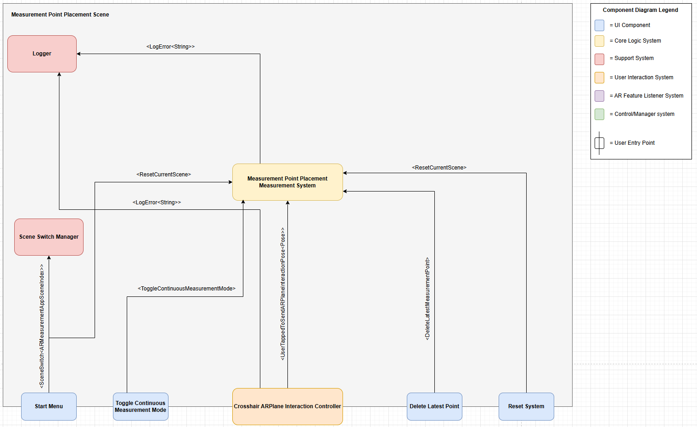
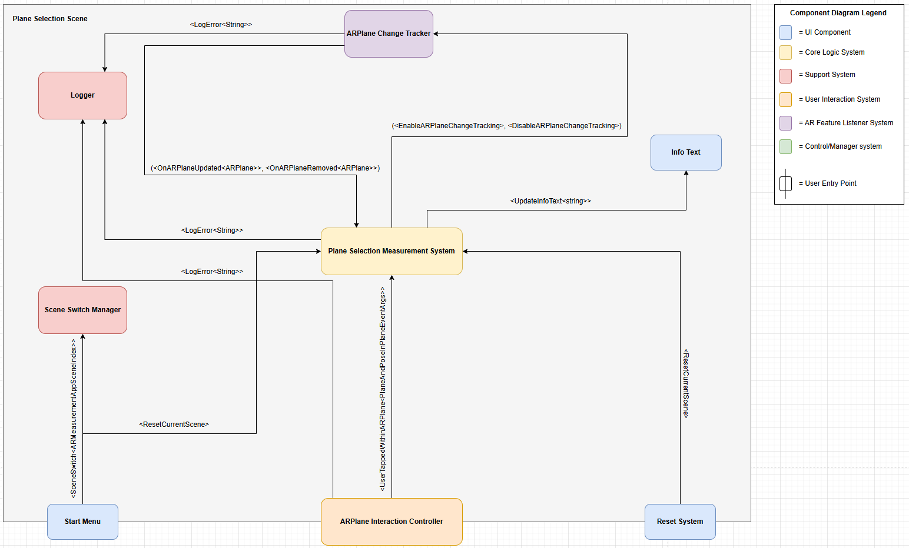
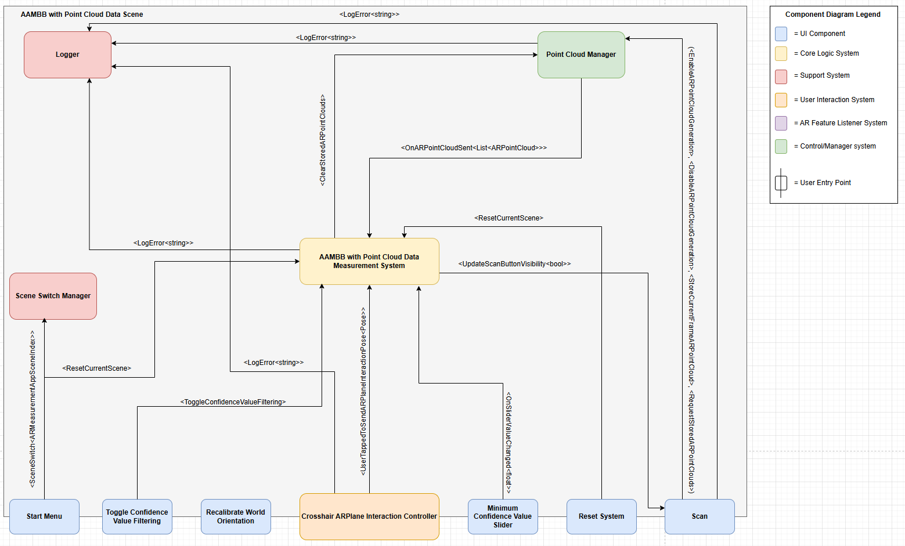
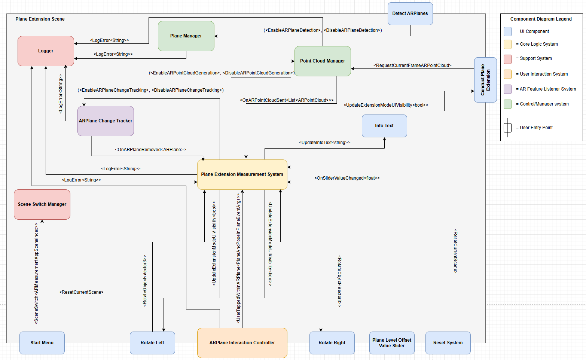
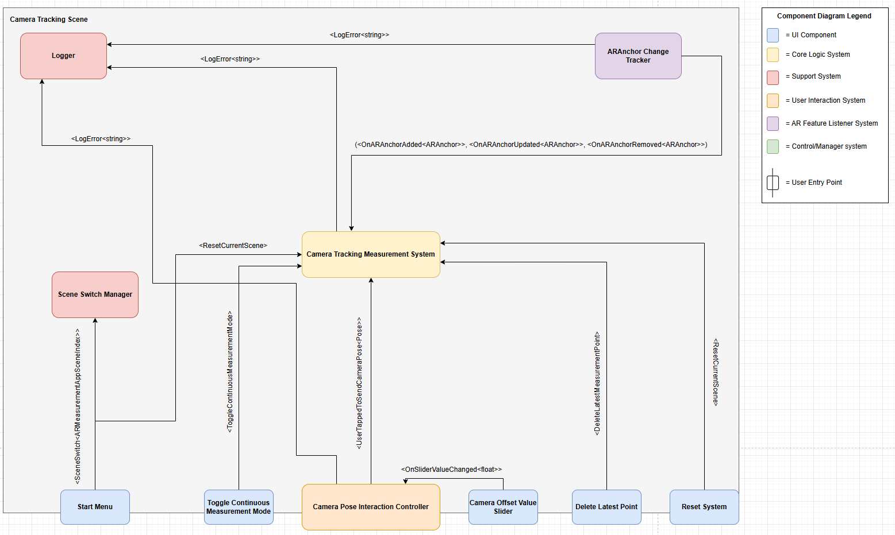
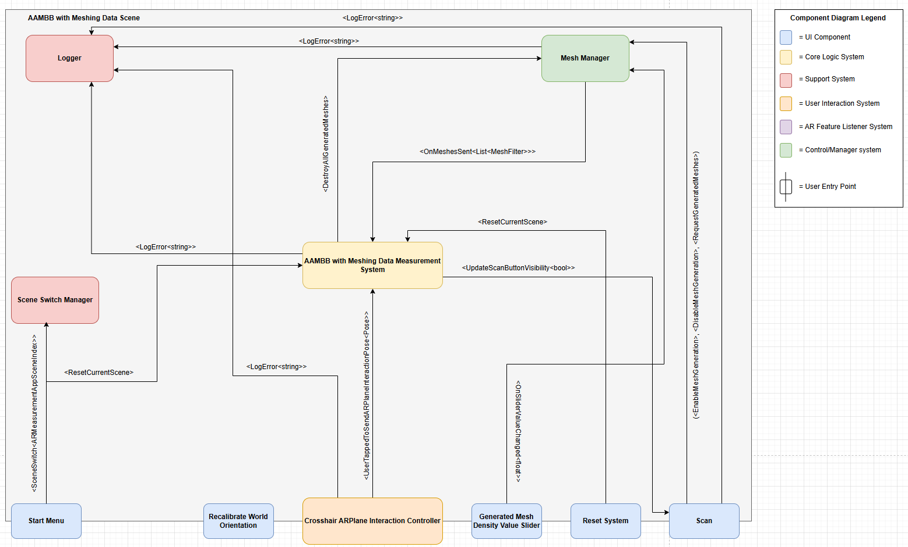
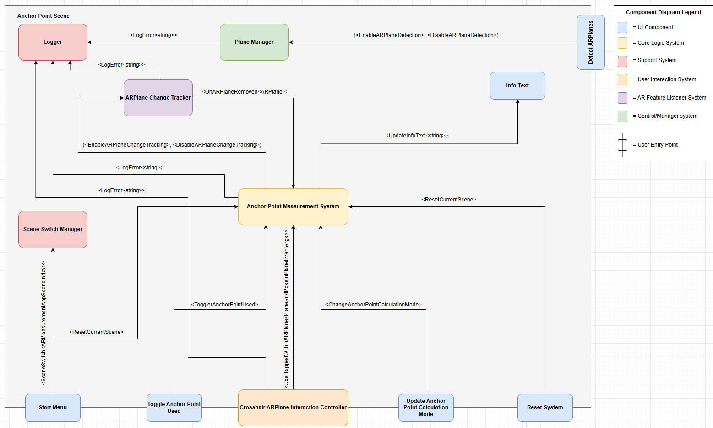
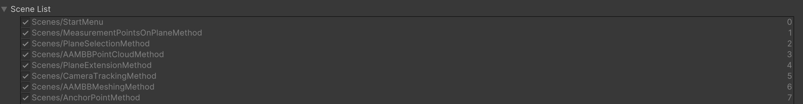

# thesis-AR-measurement
Augmented Reality measuring application developed as part of my master’s thesis. The thesis explores real-world object measurement, and this application enables users to measure real-world distances 
and object dimensions using multiple measurement methods based on various AR features. The app was tested on both Android and iOS.

# Implementation
The Unity project consists of a total of eight different scenes. One of these is the start menu, which serves as the entry point to the application 
and allows the user to choose a measurement method of their choice. The remaining scenes, which represent the available measurement methods, are as 
follows:

## Method 1 (Scene 1) - Measurement Point Placement:
The following figure shows a component diagram of the Measurement Point Placement scene implementation and illustrates the different events that are 
used to communicate between the various components: 



This measurement method allows users to place points on detected AR planes within their environment. When two or more points belonging to the same 
measurement line are placed, the system calculates the distance between them.

## Method 2 (Scene 2) - Plane Selection:
The following figure shows a component diagram of the Plane Selection scene implementation and illustrates the different events that are 
used to communicate between the various components: 



This measurement method allows the user to select a detected AR plane within the environment and receive the plane's physical height and width. 

## Method 3 (Scene 3) - Axis Aligned Minimum Bounding Box with Point Cloud Data: 
The following figure shows a component diagram of the Axis Aligned Minimum Bounding Box with Point Cloud Data scene implementation and illustrates 
the different events that are used to communicate between the various components: 



This measurement method allows the user to mark an object by placing four points to define its outline. Once the object is marked, the user can scan it by allowing point cloud feature points to be detected on its surface. These feature point positions are then used to calculate an axis aligned minimum bounding box.

## Method 4 (Scene 4) - Plane Extension:
The following figure shows a component diagram of the Plane Extension scene implementation and illustrates the different events that are 
used to communicate between the various components: 



This measurement method allows the user to select a detected AR plane within the environment to spawn an AxisAlignment object. The user can then use 
this object to align the desired width and height to be measured. The final dimensions are calculated using detected point cloud feature points.

## Method 5 (Scene 5) - Camera Tracking:
The following figure shows a component diagram of the Camera Tracking scene implementation and illustrates the different events that are 
used to communicate between the various components: 



This measurement method allows the user to store device positions and calculate the distance between them. The calculated distances and positions are visualized in the environment using AR anchors, which are represented as spheres. 

## Method 6 (Scene 6) - Axis Aligned Minimum Bounding Box with Meshing Data (iOS Only):
The following figure shows a component diagram of the Axis Aligned Minimum Bounding Box with Meshing Data scene implementation and illustrates 
the different events that are used to communicate between the various components: 



This measurement method is only available on iOS and it works by allowing  the user to mark an object by placing four points to define its outline. Once the object is marked, the user can scan it by allowing meshes to be generated on its surface. The vertex positions of the generated meshes are then used to calculate an axis aligned minimum bounding box.

## Method 7 (Scene 7) - Anchor Point:
The following figure shows a component diagram of the Anchor Point scene implementation and illustrates the different events that are 
used to communicate between the various components: 



This measurement method allows the user to select an anchor point on a detected AR plane in the environment. The distance between this point and the device is then calculated.

The Anchor Point measurement method supports three types of distance calculations:

1. **Direct Distance** – The straight-line (Euclidean) distance between the anchor point and the user's device.
2. **Horizontal Distance** – Calculated by projecting the device’s position onto the same XZ plane as the anchor point.
3. **Vertical Distance** – Calculated by projecting the device’s position onto the same Y plane as the anchor point.

# Prerequisites
This project were built and tested with the following technologies. 

- **Unity Version:** [6000.0.31f](https://unity.com/releases/editor/whats-new/6000.0.31)
- **ARFoundation Version:** [6.03](https://docs.unity3d.com/Packages/com.unity.xr.arfoundation@6.0/manual/project-setup/install-arfoundation.html)
- **ARCore Version:** [6.03](https://docs.unity3d.com/Packages/com.unity.xr.arcore@6.0/manual/index.html) (for Android)
- **ARKit Version:** [6.03](https://docs.unity3d.com/Packages/com.unity.xr.arkit@6.0/manual/index.html) (for iOS)
- **XR Plugin Management:** [4.5.0](https://docs.unity3d.com/6000.0/Documentation/Manual/configuring-project-for-xr.html) 
- [**Geometry4Sharp**](https://github.com/NewWheelTech/geometry4Sharp) - Open-Source (Boost-license) C# library for geometric computing
- A iOS or Android device that supports AR 

# Getting Started
1. Start by cloning or downloading the repository: 
```bash
git clone https://github.com/Emn98/thesis-AR-measuring.git
```

2. Open the project in Unity: 
    - Launch **Unity Hub**
    - Click **"Add"** and select the cloned/downloaded folder
    - Make sure to open it in **Unity version** ```6000.031f```

3. Install the required packages:<br>
Make sure that the following packages are installed via the **Package Manager**, found here: ```Window > Package Manager```

    - **ARFoundation:** ```6.03```  
    - **ARCore:** ```6.03```  
    - **ARKit:** ```6.03```  
    - **XR Plugin Management:** ```4.5.0```  

4. Add the Geometry4Sharp library: 
    - Download the zip file from [here](https://github.com/NewWheelTech/geometry4Sharp)
    - Unzip the file and drag it into the **"Assets"** folder of the project
    - Go to ```Edit > Project Settings > Player``` and add ```G3_USING_UNITY``` under **Script Compilation**

5. Enable XR support: <br>
Go to ```Edit > Project Settings > XR Plug-in Management``` and:
    - Enable **ARKit** for iOS
    - Enable **ARCore** for Android

6. Add Scenes to build settings: <br>
Open `File > Build Settings` and ensure that all scenes are added in the order specified in the figure below.



If they are not already listed, add all the scenes to the scene list in the same order as in the figure above.

7. Build and run:<br> 
    - Go to ```File > Build Settings```
    - For **Android**:
        - Connect the Android device to the computer, make sure it can build these kind of applications. 
        - Select your connected device under the **"Run Device"** option
        - Click on **Build and Run**
    - For **iOS**
        - Make sure **debug** is selected as the option for the **"Run in Xcode as"** setting
        - Open the built project in **Xcode**
        - Connect the iOS device and build the project to the device via **Xcode** 
